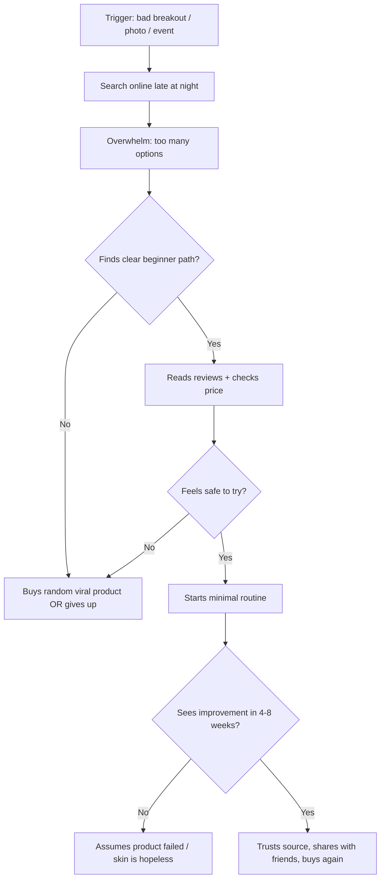

# Customer Persona: Maya Chen

> **Segment:** Acne-prone beginner seeking skincare help online  
> **Priority:** Primary target customer for Angelina

---

## Snapshot

| Field | Detail |
|-------|--------|
| **Name** | Maya Chen (composite persona) |
| **Age** | 22 |
| **Location** | Suburban US, lives with roommates |
| **Occupation** | Junior marketing coordinator |
| **Income** | ~$48k/year — budget-conscious but willing to spend on something that works |
| **Skin type** | Oily/combination, frequent breakouts |
| **Skincare knowledge** | Near zero — knows "wash your face" and that's about it |

---

## Who She Is

Maya has dealt with acne since her teens. It never fully went away. Now it's worse again — stress, irregular sleep, cheap makeup, and touching her face without thinking. She avoids mirrors on bad days and has started canceling plans when a breakout is "really visible."

She is **not lazy** and **not uninterested** in fixing her skin. She is **overwhelmed**. Every TikTok, Reddit thread, and Sephora shelf contradicts the last one. She has bought random products (a charcoal mask, a viral serum, drugstore "acne wash") with no routine and no results.

She is actively online right now because a photo from last weekend made her feel awful, and she typed something like *"how do I fix my acne"* or *"skincare for beginners"* into Google, TikTok, or Reddit.

---

## Goals

### Primary goals
- Clear, calmer skin she does not have to hide with concealer every day
- A simple plan she can actually follow — not a 12-step routine
- Understand **why** her skin breaks out so she stops blaming herself

### Secondary goals
- Stop wasting money on products that make things worse
- Feel confident at work, on dates, and in photos
- Find advice that feels trustworthy, not salesy

---

## Pain Points

### Emotional
- Embarrassment and self-consciousness in social and professional settings
- Shame spiral: "Maybe I'm just doing something wrong" / "Everyone else figured this out except me"
- Anxiety before events: *Will my skin look terrible in that lighting?*

### Practical
- **Information overload:** retinol, niacinamide, salicylic acid, double cleansing, SPF — none of it maps to a starting point
- **Contradictory advice:** "moisturize oily skin" vs. "dry it out to kill acne"
- **No diagnosis:** doesn't know if it's hormonal, fungal, comedonal, or irritation from products
- **Past failures:** products that stung, peeled, or broke her out more
- **Time and consistency:** forgets routines, travels, shares a bathroom with roommates

### Financial
- Can't afford a dermatologist visit right now (or thinks she can't)
- Skeptical of $80 serums when a $12 option might work
- Afraid of buying a full "starter kit" that doesn't fit her skin

---

## Knowledge Level (Zero → What She Actually Knows)

| Topic | Her understanding |
|-------|-------------------|
| Skin types | Vague idea she is "oily" |
| Ingredients | Heard of salicylic acid; doesn't know what it does or when to use it |
| Routine order | None — applies products randomly |
| SPF | Knows it's "good" but skips it because moisturizers feel greasy |
| Diet & lifestyle | Suspects sugar and stress matter; no clear link |
| When to see a derm | Thinks that's only for "severe" acne — doesn't think hers qualifies |

**What she says:** *"I just want someone to tell me what to do first."*

---

## Online Behavior (Right Now)

### Where she looks
1. **TikTok / Instagram Reels** — short "dermatologist reacts" and before/after videos
2. **Reddit** — r/SkincareAddiction, r/acne (lurks more than posts)
3. **Google** — "skincare routine for beginners," "best products for acne," "why is my acne getting worse"
4. **YouTube** — 10–15 min explainer videos when she's motivated at night
5. **Amazon / Target reviews** — checks stars but doesn't trust fake reviews

### Search queries (real examples)
- `simple skincare routine for acne beginners`
- `why does my acne keep coming back`
- `difference between salicylic acid and benzoyl peroxide`
- `dermatologist skincare routine drugstore`
- `is my acne hormonal how to tell`
- `skincare order for dummies`

### Content she engages with
- **Before/after** with similar skin tone and age
- **"Start here"** lists with 3–4 products max
- **Myth-busting** ("oily skin still needs moisturizer")
- **Week-by-week timelines** ("what to expect in month 1")
- **Failure stories** that end in a fix — not perfect-skin influencers only

### Content she ignores or distrusts
- 12-step luxury routines
- Influencers with flawless skin selling their own brand
- Fear-based ads ("toxins in your cleanser!")
- Medical jargon with no translation
- "Just drink water" advice

---

## Decision Journey

### Moments that win her trust
- Plain language, no gatekeeping
- "If you're new, start with these 2 steps"
- Clear warning signs (when to stop a product, when to see a doctor)
- Realistic timelines — not "clear skin in 3 days"
- Options at different price points

### Moments that lose her
- Upsell before education
- Assuming she already knows ingredient names
- Blaming her for "not being consistent enough"
- Before/afters that look filtered or unrelated to her skin type

---

## Objections & Fears

| Objection | What she's really thinking |
|-----------|---------------------------|
| "I've tried everything" | *Nothing worked for me — why would this?* |
| "This might make it worse" | *Purging? Irritation? I can't risk a wedding next month.* |
| "I don't have time for this" | *A 30-second routine maybe; not a spa ritual.* |
| "I can't afford a dermatologist" | *Is online advice enough? Am I being irresponsible?* |
| "My skin is different" | *What if this works for everyone except me?* |

---

## What She Needs From Angelina

### Must-haves
1. **Beginner-first onboarding** — "What's your skin like?" not "Pick your actives"
2. **A staged plan** — Week 1: cleanse + moisturize + SPF. Add treatment only when ready.
3. **Ingredient decoder** — what it is, what it does, what to watch for
4. **Progress tracker** — photos + notes so she sees slow improvement
5. **Red flags guide** — when to stop, when to see a professional

### Nice-to-haves
- Drugstore vs. mid-range product suggestions with links
- Reminder notifications she won't hate
- Community stories from people who also started from zero
- Gentle accountability without guilt

### Success looks like (for her)
- Within **2 weeks:** routine feels doable, skin less tight/irritated  
- Within **6–8 weeks:** fewer new breakouts, understands her triggers  
- Within **3 months:** confident enough to recommend the app to a friend

---

## Voice & Messaging That Resonates

### Say this
- "You don't need a 10-step routine to start."
- "Here's what to do tonight — one step at a time."
- "Confused? That's normal. We'll keep it simple."
- "Your acne isn't a moral failing."

### Avoid this
- "Transform your skin overnight"
- "You're using the wrong products" (judgmental)
- Dense ingredient lists without context
- Assuming she knows what comedogenic means

---

## Sample Day-in-the-Life

**7:45 AM** — Wakes up, sees a new chin breakout, sighs, applies whatever cleanser is in the shower, skips moisturizer because skin feels oily.

**12:30 PM** — At lunch, scrolls TikTok, saves a "dermatologist approved" video, doesn't buy anything yet.

**6:00 PM** — Googles whether popping is bad (again). Reads conflicting answers.

**10:30 PM** — Motivation spike. Opens Reddit, reads a beginner routine thread, gets overwhelmed by abbreviations (AM, PM, AHA, BHA). Closes app.

**10:45 PM** — Searches "easiest acne routine for people who know nothing." **This is when Angelina should meet her.**

---

## Persona Tags (for internal use)

`acne` `beginner` `overwhelmed` `online-researcher` `budget-conscious` `trust-seeking` `routine-averse` `high-intent` `low-knowledge`

---

## Related Personas (future)

- **Jordan** — slightly more knowledgeable, product collector, needs simplification  
- **Alex** — severe/cystic acne, ready for dermatologist referral pathway  
- **Sam** — post-acne scarring focus, past the active breakout phase
